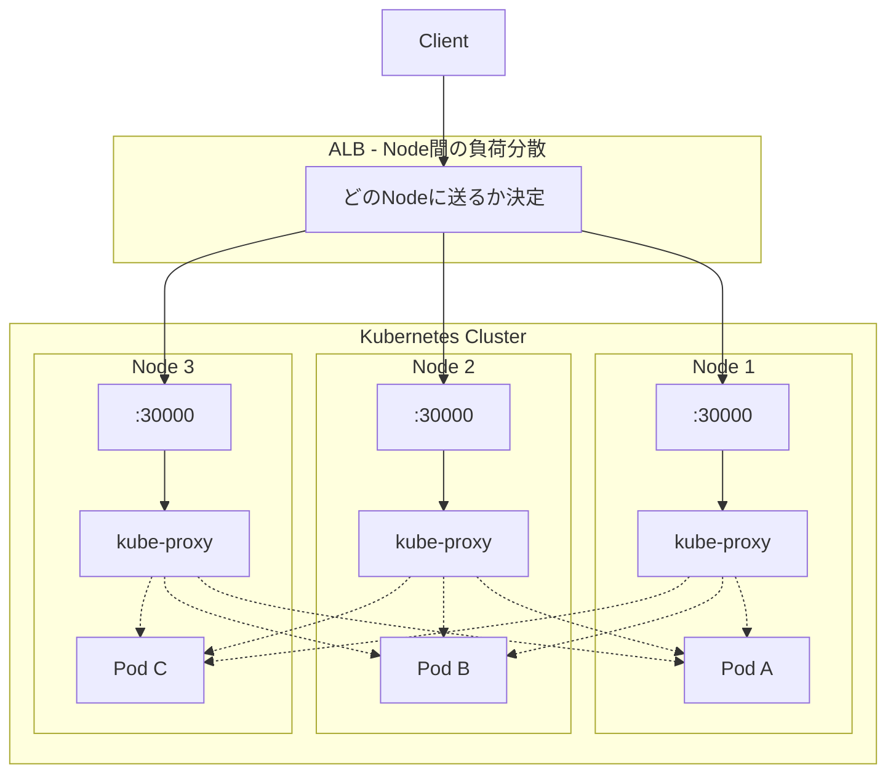
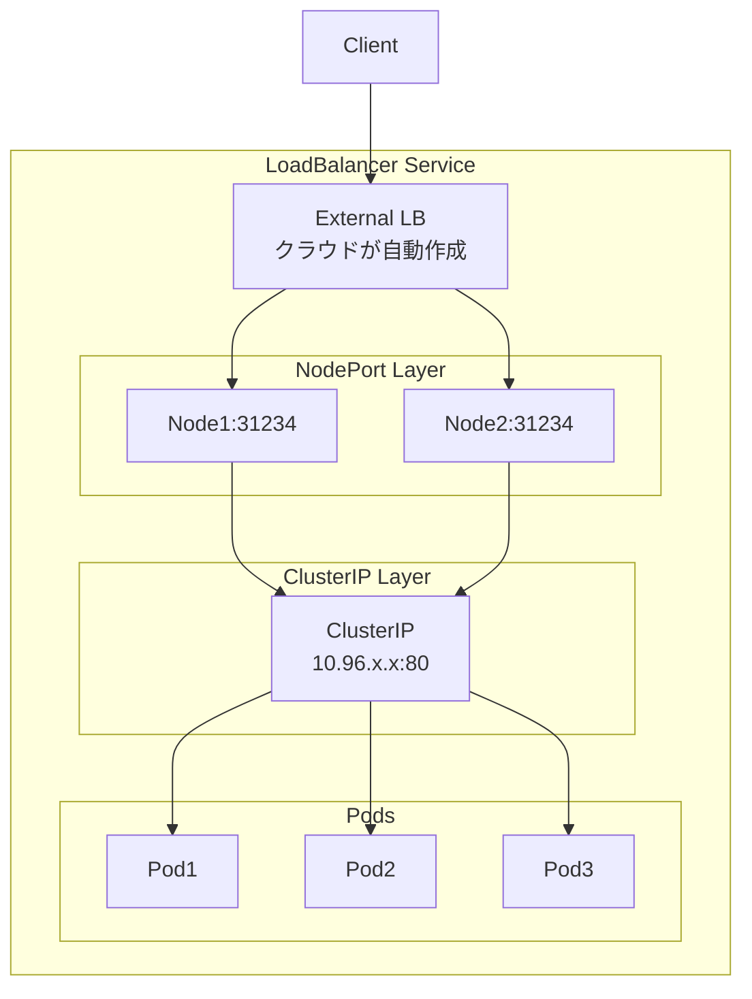
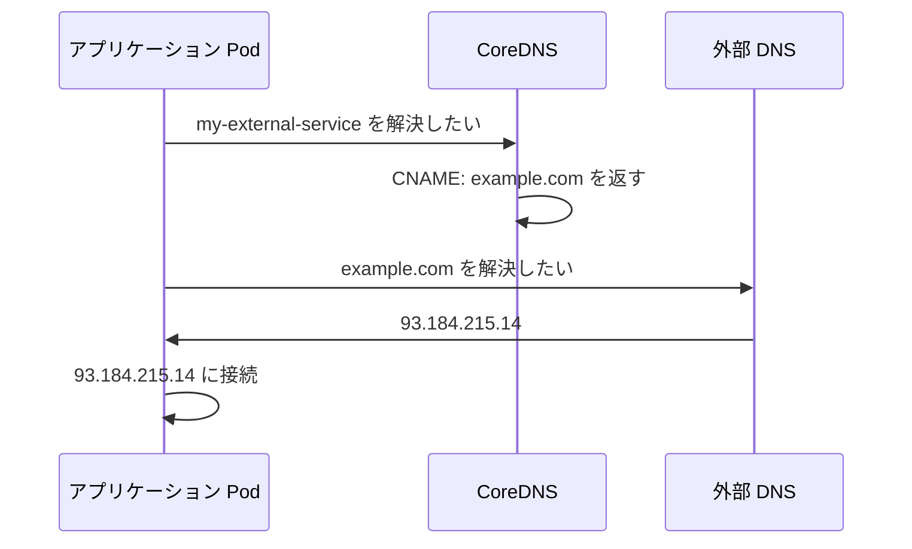

# Pod へのアクセスは Service を使おう

ReplicaSet によって Pod を複数作成しましたが、Pod へどのようにリクエストをするのでしょうか？

Pod には個別に IP が割り振られています。複数の Pod に対して均等にリクエストを分散させたい場合に便利なのが **Service** です。

このガイドでは **kind** を使って複数 Node のクラスターを構築し、Service の動作を確認します。

---

## 準備

### kind のインストール

```bash
brew install kind
```

### 複数 Node のクラスターを作成

3 Node（control-plane 1台 + worker 2台）のクラスターを作成します。

`./manifests/kind-config.yaml`:

```yaml
kind: Cluster
apiVersion: kind.x-k8s.io/v1alpha4
nodes:
  - role: control-plane
  - role: worker
  - role: worker
```

クラスターを作成:

```bash
kind create cluster --name service-demo --config=./manifests/kind-config.yaml
```

### コンテキストの確認

kind クラスター作成時に自動でコンテキストが切り替わります。

```bash
k config current-context
```

```
kind-service-demo
```

コンテキスト一覧を確認:

```bash
k config get-contexts
```

```
CURRENT   NAME                 CLUSTER              AUTHINFO             NAMESPACE
          docker-desktop       docker-desktop       docker-desktop
*         kind-service-demo    kind-service-demo    kind-service-demo
```

> **補足**: 複数クラスターがある場合は `k config use-context kind-service-demo` で切り替えられます。

### Node の確認

```bash
k get nodes
```

```
NAME                         STATUS   ROLES           AGE   VERSION
service-demo-control-plane   Ready    control-plane   60s   v1.27.3
service-demo-worker          Ready    <none>          30s   v1.27.3
service-demo-worker2         Ready    <none>          30s   v1.27.3
```

### namespace を用意

```bash
k create namespace dev
```

### ReplicaSet を用意

Pod がどの Node で動いているか確認できるように環境変数を設定します。

`./manifests/nginx-replicaset.yaml`:

```yaml
apiVersion: apps/v1
kind: ReplicaSet
metadata:
  name: nginx-replicaset      # ReplicaSet の名前
  namespace: dev              # 作成する namespace
spec:
  replicas: 6                 # 作成する Pod の数
  selector:                   # 管理対象の Pod を選択するラベル
    matchLabels:
      app: nginx
  template:                   # Pod のテンプレート
    metadata:
      labels:
        app: nginx            # Pod に付与するラベル（selector と一致させる）
    spec:
      containers:
      - name: nginx
        image: nginx:latest
        env:
        - name: NODE_NAME               # 環境変数 NODE_NAME
          valueFrom:
            fieldRef:
              fieldPath: spec.nodeName  # Pod が動いている Node 名を取得
        - name: POD_NAME                # 環境変数 POD_NAME
          valueFrom:
            fieldRef:
              fieldPath: metadata.name  # Pod 自身の名前を取得
```

適用:

```bash
k apply -f ./manifests/nginx-replicaset.yaml
```

### Pod の配置を確認

```bash
k get pod -n dev -o wide
```

```
NAME                     READY   STATUS    IP           NODE
nginx-replicaset-abc12   1/1     Running   10.244.1.2   service-demo-worker
nginx-replicaset-def34   1/1     Running   10.244.1.3   service-demo-worker
nginx-replicaset-ghi56   1/1     Running   10.244.2.2   service-demo-worker2
nginx-replicaset-jkl78   1/1     Running   10.244.2.3   service-demo-worker2
nginx-replicaset-mno90   1/1     Running   10.244.0.5   service-demo-control-plane
nginx-replicaset-pqr12   1/1     Running   10.244.0.6   service-demo-control-plane
```

6 つの Pod が 3 つの Node に分散配置されています。

---

## Service の作成方法

```bash
k create service <サービスのタイプ> <サービスの名前> --tcp=<ホスト側のポート>:<コンテナ側のポート>
```

## Service のタイプ一覧

| タイプ | 説明 |
|--------|------|
| **ClusterIP** | Kubernetes 内部ネットワークでのみアクセス可能（デフォルト） |
| **NodePort** | クラスタ内共通で1つのポート(30000-32767)を各ノードに割り当て、外部からアクセス可能 |
| **LoadBalancer** | クラウドプロバイダのロードバランサーをプロビジョニングし、外部からアクセス可能 |
| **ExternalName** | サービス名を外部ドメイン名に解決するDNSエイリアス |

---

## ClusterIP: 内部ネットワークでアクセス可能な Service

内部ネットワークでのみ利用できるホスト名を提供したい場合に使用します。

### `./manifests/nginx-service-clusterip.yaml`

```yaml
apiVersion: v1
kind: Service
metadata:
  labels:
    app: nginx-service
  name: nginx-service         # Service の名前
  namespace: dev
spec:
  ports:
    - name: http              # ポートの名前（任意）
      port: 80                # Service が LISTEN するポート番号
      protocol: TCP
      targetPort: 80          # Pod が LISTEN しているポート番号
  selector:
    app: nginx                # このラベルに一致する Pod にトラフィックを送る
  type: ClusterIP             # Service のタイプ
```

### 適用

```bash
k apply -f ./manifests/nginx-service-clusterip.yaml
```

### Service の確認

```bash
k -n dev get svc
```

```
NAME            TYPE        CLUSTER-IP      EXTERNAL-IP   PORT(S)   AGE
nginx-service   ClusterIP   10.96.xxx.xxx   <none>        80/TCP    5s
```

### クラスター外からアクセスできないことを確認

ClusterIP はクラスター内部からのみアクセス可能です。ホストマシンからはアクセスできません。

```bash
# ホストマシンから CLUSTER-IP にアクセス（失敗する）
curl --head --max-time 3 http://10.96.xxx.xxx
```

```
curl: (28) Connection timed out after 3001 milliseconds
```

### クラスター内部からアクセスできることを確認

```bash
k -n dev run curl-pod --restart=Never -it --rm --image=curlimages/curl:latest -- curl --head http://nginx-service
```

```
HTTP/1.1 200 OK
Server: nginx/1.27.0
Date: Tue, 13 Aug 2024 22:54:53 GMT
Content-Type: text/html
Content-Length: 615
Last-Modified: Tue, 28 May 2024 13:22:30 GMT
Connection: keep-alive
ETag: "6655da96-267"
Accept-Ranges: bytes

pod "curl-pod" deleted
```

### 複数の Pod に分散されていることを確認

各 Pod が自分の名前を返すように設定します。

```bash
# 全 Pod の index.html を Pod 名に書き換え
for pod in $(k get pod -n dev -l app=nginx -o jsonpath='{.items[*].metadata.name}'); do
  k exec -n dev $pod -- sh -c "echo $pod > /usr/share/nginx/html/index.html"
done
```

複数回アクセスして、異なる Pod に分散されることを確認します。

```bash
# クラスター内から 10 回アクセス
k -n dev run curl-pod --restart=Never -it --rm --image=curlimages/curl:latest -- \
  sh -c 'for i in $(seq 1 10); do curl -s http://nginx-service; done'
```

```
nginx-replicaset-abc12
nginx-replicaset-ghi56
nginx-replicaset-def34
nginx-replicaset-abc12
nginx-replicaset-mno90
nginx-replicaset-jkl78
nginx-replicaset-pqr12
nginx-replicaset-def34
nginx-replicaset-ghi56
nginx-replicaset-abc12
```

リクエストが複数の Pod に分散されていることが確認できます。

### ClusterIP の Service を削除

```bash
k delete -f ./manifests/nginx-service-clusterip.yaml
```

---

## NodePort: 外部からアクセス可能な Service

クラスター共通のポートを確保して、全ての Node に設定します。

### `./manifests/nginx-service-nodeport.yaml`

```yaml
apiVersion: v1
kind: Service
metadata:
  labels:
    app: nginx-service
  name: nginx-service         # Service の名前
  namespace: dev
spec:
  ports:
    - name: http              # ポートの名前（任意）
      port: 80                # Service が LISTEN するポート番号
      protocol: TCP
      targetPort: 80          # Pod が LISTEN しているポート番号
      nodePort: 30000         # Node で LISTEN するポート（30000-32767）
  selector:
    app: nginx                # このラベルに一致する Pod にトラフィックを送る
  type: NodePort              # Service のタイプ
```

### ClusterIP からの差分

```diff
spec:
  ports:
    - name: http
      port: 80
      protocol: TCP
      targetPort: 80
+     nodePort: 30000
  selector:
    app: nginx
- type: ClusterIP
+ type: NodePort
```

### 適用と確認

```bash
k apply -f ./manifests/nginx-service-nodeport.yaml
k -n dev get svc
```

実行結果:

```
NAME            TYPE       CLUSTER-IP      EXTERNAL-IP   PORT(S)        AGE
nginx-service   NodePort   10.96.xxx.xxx   <none>        80:30000/TCP   5s
```

### NodePort の動作確認

NodePort は全ての Node で同じポート(30000)を開きます。

#### 特定の Node からアクセスして Pod への分散を確認

worker Node のコンテナに入って確認します:

```bash
docker exec -it service-demo-worker bash
```

Node 内から複数回アクセス:

```bash
for i in {1..10}; do
  curl -s http://localhost:30000 2>/dev/null | head -1
done
```

#### 重要: NodePort はクラスター全体の Pod に分散する

```
service-demo-worker:30000 にアクセスしても:

┌─────────────────────────────────────────────────────────────┐
│                                                             │
│  worker:30000 ─→ kube-proxy ─┬─→ worker の Pod             │
│                              ├─→ worker2 の Pod   ← 他Node │
│                              └─→ control-plane の Pod      │
│                                                             │
└─────────────────────────────────────────────────────────────┘
```

**どの Node にアクセスしても、クラスター全体の Pod に負荷分散されます。**

#### kube-proxy の転送先リストを確認

各 Node の kube-proxy がクラスター全体の Pod を知っていることを確認します。

まず、Service の Endpoints（転送先 Pod の IP リスト）を確認:

```bash
k get endpoints -n dev nginx-service
```

```
NAME            ENDPOINTS
nginx-service   10.244.1.2:80,10.244.1.3:80,10.244.1.4:80,10.244.2.2:80,10.244.2.3:80,10.244.2.4:80
```

次に、Pod IP がどの Node に対応するか確認:

```bash
k get pod -n dev -o wide
```

```
NAME                     IP           NODE
nginx-replicaset-6tl5f   10.244.1.2   service-demo-worker2
nginx-replicaset-kkqzt   10.244.1.3   service-demo-worker2
nginx-replicaset-kvgnl   10.244.1.4   service-demo-worker2
nginx-replicaset-rvv2x   10.244.2.2   service-demo-worker
nginx-replicaset-l2gkw   10.244.2.3   service-demo-worker
nginx-replicaset-ggbwb   10.244.2.4   service-demo-worker
```

#### iptables ルールで確認（詳細）

Node 内に入って、kube-proxy が作成した iptables ルールを確認します:

```bash
docker exec -it service-demo-worker bash
iptables -t nat -L -n | grep "nginx-service:http ->"
```

```
/* dev/nginx-service:http -> 10.244.1.2:80 */ statistic mode random probability 0.16666666651
/* dev/nginx-service:http -> 10.244.1.3:80 */ statistic mode random probability 0.20000000019
/* dev/nginx-service:http -> 10.244.1.4:80 */ statistic mode random probability 0.25000000000
/* dev/nginx-service:http -> 10.244.2.2:80 */ statistic mode random probability 0.33333333349
/* dev/nginx-service:http -> 10.244.2.3:80 */ statistic mode random probability 0.50000000000
/* dev/nginx-service:http -> 10.244.2.4:80 */
```

**確認できること:**

- `service-demo-worker` の kube-proxy が `worker2` の Pod IP も知っている
- `probability` で各 Pod に均等（約 1/6）に振り分けている
- **自分の Node 以外の Pod にも転送できる**

```
service-demo-worker 内の kube-proxy:

  10.244.1.2 (worker2)  ← 他の Node
  10.244.1.3 (worker2)  ← 他の Node
  10.244.1.4 (worker2)  ← 他の Node
  10.244.2.2 (worker)   ← 自分の Node
  10.244.2.3 (worker)   ← 自分の Node
  10.244.2.4 (worker)   ← 自分の Node
```

他の Node でも同様に確認できます:

```bash
# worker2 でも確認
docker exec -it service-demo-worker2 iptables -t nat -L -n | grep "nginx-service:http ->"

# control-plane でも確認
docker exec -it service-demo-control-plane iptables -t nat -L -n | grep "nginx-service:http ->"
```

どの Node でも同じ 6 つの Pod IP が転送先として登録されています。

#### nginx ログで確認

```bash
# 各 Pod のログをリアルタイムで確認（Ctrl+C で終了）
k logs -n dev -l app=nginx --prefix=true -f --max-log-requests=10
```

別ターミナルからリクエストを送ると、複数の Pod にログが出力されることが確認できます。

### NodePort だけでは足りない理由

NodePort はクラスター内の Pod への負荷分散はしてくれますが、**クラスター外からアクセスする場合、どの Node にアクセスするかは自分で決める必要があります**。

```
クラスター外からのアクセス:

  Client → ??? → Node:30000 → kube-proxy → Pod

  「???」の部分を誰かが解決する必要がある
```

問題点:

- 特定の Node IP を指定すると、その Node が障害時にアクセス不可
- 複数 Node に均等にアクセスしたい
- Node の増減に対応したい

### NodePort と ALB の役割分担



> **ポイント**: 各 Node の kube-proxy は、どの Node の Pod にも転送できる（点線）

| 役割 | 担当 |
|------|------|
| Client → Node の振り分け | ALB |
| Node → Pod の振り分け | NodePort (kube-proxy) |

### だから LoadBalancer タイプがある

NodePort + ALB を手動で設定するのは面倒なので、`type: LoadBalancer` を使えば Kubernetes が自動で ALB/NLB を作成してくれます。

```yaml
type: LoadBalancer  # クラウド環境で ALB/NLB を自動作成
```

```
NodePort を使う場合:
  1. NodePort の Service を作成
  2. ALB を手動で作成
  3. ALB のターゲットに各 Node:30000 を登録
  4. Node 増減時に ALB の設定も更新

LoadBalancer を使う場合:
  1. LoadBalancer の Service を作成
  → 以上（ALB の作成・設定は自動）
```

### NodePort の Service を削除

```bash
k delete -f ./manifests/nginx-service-nodeport.yaml
```

---

## LoadBalancer: ロードバランサー経由でアクセス可能な Service

外部のロードバランサーリソースをプロビジョニングします。

### LoadBalancer の仕組み

LoadBalancer は **ClusterIP + NodePort + 外部LB** の3層構造です。



LoadBalancer Service を作成すると:

1. **ClusterIP** を作成（内部通信用）
2. **NodePort** を作成（全 Node でポート開放）
3. **クラウドコントローラー**が外部 LB をプロビジョニング
4. 外部 LB が各 Node の NodePort にトラフィックを送る

つまり、LoadBalancer は NodePort の上に「外部 LB の自動作成」を追加したものです。

### `./manifests/nginx-service-loadbalancer.yaml`

```yaml
apiVersion: v1
kind: Service
metadata:
  labels:
    app: nginx-service
  name: nginx-service         # Service の名前
  namespace: dev
spec:
  ports:
    - name: http              # ポートの名前（任意）
      port: 80                # Service が LISTEN するポート番号
      protocol: TCP
      targetPort: 80          # Pod が LISTEN しているポート番号
  selector:
    app: nginx                # このラベルに一致する Pod にトラフィックを送る
  type: LoadBalancer          # Service のタイプ
```

### NodePort からの差分

```diff
spec:
  ports:
    - name: http
      port: 80
      protocol: TCP
      targetPort: 80
-     nodePort: 30000
  selector:
    app: nginx
- type: NodePort
+ type: LoadBalancer
```

### 適用と確認

```bash
k apply -f ./manifests/nginx-service-loadbalancer.yaml
k get svc -n dev nginx-service
```

```
NAME            TYPE           CLUSTER-IP      EXTERNAL-IP   PORT(S)        AGE
nginx-service   LoadBalancer   10.96.xxx.xxx   <pending>     80:31234/TCP   5s
```

kind では `<pending>` のままですが、AWS EKS などでは:

```
NAME            TYPE           CLUSTER-IP      EXTERNAL-IP                              PORT(S)
nginx-service   LoadBalancer   10.96.xxx.xxx   xxx.elb.amazonaws.com                    80:31234/TCP
```

のように外部からアクセス可能な DNS 名が割り当てられます。

### kind で LoadBalancer を確認する（MetalLB）

kind はローカル環境のため、デフォルトでは外部 LB が作成されません。
**MetalLB** を使えばローカルでも LoadBalancer を確認できます。

#### MetalLB のインストール

```bash
# MetalLB をインストール
k apply -f https://raw.githubusercontent.com/metallb/metallb/v0.13.12/config/manifests/metallb-native.yaml

# Pod が起動するまで待機
k wait --namespace metallb-system \
  --for=condition=ready pod \
  --selector=app=metallb \
  --timeout=90s
```

#### kind の Docker ネットワーク IP 範囲を確認

```bash
docker network inspect -f '{{.IPAM.Config}}' kind
```

```
[{172.18.0.0/16  172.18.0.1 map[]}]
```

この例では `172.18.0.0/16` が kind のネットワークです。

#### MetalLB の設定

`./manifests/metallb-config.yaml`:

```yaml
apiVersion: metallb.io/v1beta1
kind: IPAddressPool
metadata:
  name: example
  namespace: metallb-system
spec:
  addresses:
  - 172.18.255.200-172.18.255.250  # kind ネットワーク内の未使用 IP 範囲（要調整）
---
apiVersion: metallb.io/v1beta1
kind: L2Advertisement
metadata:
  name: empty
  namespace: metallb-system
```

```bash
k apply -f ./manifests/metallb-config.yaml
```

#### LoadBalancer の動作確認

```bash
# LoadBalancer Service を適用
k apply -f ./manifests/nginx-service-loadbalancer.yaml

# EXTERNAL-IP が割り当てられることを確認
k get svc -n dev nginx-service
```

```
NAME            TYPE           CLUSTER-IP      EXTERNAL-IP      PORT(S)        AGE
nginx-service   LoadBalancer   10.96.xxx.xxx   172.18.xxx.xxx   80:31234/TCP   5s
```

`<pending>` ではなく、実際の IP が割り当てられます。

#### LoadBalancer は 3 層構造

LoadBalancer Service を作成すると、ClusterIP と NodePort も同時に作成されます:

```bash
k get svc -n dev nginx-service -o yaml | grep -E "clusterIP:|nodePort:|type:"
```

```
  clusterIP: 10.96.xxx.xxx
    nodePort: 31234
  type: LoadBalancer
```

```
┌─────────────────────────────────────────────────────┐
│ LoadBalancer                                        │
│   EXTERNAL-IP: 172.18.xxx.xxx                       │
│                                                     │
│  ┌───────────────────────────────────────────────┐  │
│  │ NodePort                                      │  │
│  │   全 Node で :31234 を LISTEN                 │  │
│  │                                               │  │
│  │  ┌─────────────────────────────────────────┐  │  │
│  │  │ ClusterIP                               │  │  │
│  │  │   10.96.xxx.xxx:80                      │  │  │
│  │  └─────────────────────────────────────────┘  │  │
│  └───────────────────────────────────────────────┘  │
└─────────────────────────────────────────────────────┘
```

| タイプ | 含まれるレイヤー |
|--------|------------------|
| ClusterIP | ClusterIP のみ |
| NodePort | ClusterIP + NodePort |
| LoadBalancer | ClusterIP + NodePort + 外部LB |

#### 3 つのレイヤー全てでアクセスできることを確認

**1. ClusterIP 経由（クラスター内部から）**

```bash
k run curl-test -n dev --rm -it --restart=Never --image=curlimages/curl:latest \
  -- curl -s http://10.96.xxx.xxx
```

```
nginx-replicaset-abc12
```

**2. NodePort 経由（Node から）**

```bash
docker exec service-demo-worker curl -s http://localhost:31234
```

```
nginx-replicaset-def34
```

**3. LoadBalancer 経由（外部から）**

macOS の場合、Docker Desktop の制限により、ホストから Docker ネットワーク（`172.18.x.x`）に直接アクセスできません。

```
macOS Host
  └── Docker Desktop (Linux VM)
        └── Docker Network "kind" (172.18.0.0/16)  ← ここにしかルートがない
              ├── kind-control-plane
              ├── kind-worker
              ├── kind-worker2
              └── LoadBalancer IP (172.18.xxx.xxx)
```

同じ Docker ネットワーク内からアクセスする必要があります。

まず、kind クラスターが使用しているネットワーク名を確認:

```bash
docker network ls | grep kind
```

```
xxxxxxxx   kind   bridge   local
```

このネットワークに接続したコンテナから curl します:

```bash
# Docker ネットワーク "kind" 内から EXTERNAL-IP にアクセス
docker run --rm --network kind curlimages/curl:latest curl -s http://172.18.xxx.xxx
```

```
nginx-replicaset-abc12
```

LoadBalancer 経由でクラスター内の Pod にアクセスできることが確認できます。

### LoadBalancer の Service を削除

```bash
k delete -f ./manifests/nginx-service-loadbalancer.yaml
```

### MetalLB を削除（オプション）

MetalLB が不要な場合は削除します:

```bash
# MetalLB の設定を削除
k delete -f ./manifests/metallb-config.yaml

# MetalLB 本体を削除
k delete -f https://raw.githubusercontent.com/metallb/metallb/v0.13.12/config/manifests/metallb-native.yaml
```

---

## ExternalName: 外部ドメインのエイリアスになる Service

ExternalName は他の Service タイプとは異なり、**DNS の CNAME レコード**を作成します。クラスター内から外部サービスに「Kubernetes 的な名前」でアクセスできるようになります。

### ExternalName の特徴

| 項目 | ClusterIP / NodePort / LoadBalancer | ExternalName |
|------|-------------------------------------|--------------|
| ClusterIP | あり | **なし** |
| Endpoints | あり | **なし** |
| selector | あり | **なし** |
| 負荷分散 | kube-proxy が行う | **なし**（DNS 任せ） |
| 仕組み | IP ベースのプロキシ | **CNAME レコード** |

### ユースケース

ExternalName は以下のような場面で便利です：

**1. 外部サービスへの接続を抽象化**

```
アプリケーションのコード:
  url = "http://database-service"   ← Kubernetes 内の名前で統一

開発環境:
  database-service → dev-db.internal.example.com

本番環境:
  database-service → prod-db.rds.amazonaws.com
```

環境ごとに ExternalName の `externalName` を変えるだけで、アプリケーションコードの変更なしに接続先を切り替えられます。

**2. 外部から内部への移行**

```
Phase 1: ExternalName で外部 DB を参照
  my-db → external-database.example.com

Phase 2: 内部に DB を構築後、Service を ClusterIP に変更
  my-db → 内部の Pod 群
```

アプリケーションは `my-db` を使い続けるだけで、移行が完了します。

**3. 長いドメイン名のエイリアス**

```yaml
externalName: my-very-long-service-name.region.provider.example.com
```

を `short-name` として参照できます。

### ExternalName の仕組み



**重要**: ExternalName は DNS レベルでの解決のみを行います。kube-proxy によるプロキシは一切行われません。

### `./manifests/external-name-service.yaml`

```yaml
apiVersion: v1
kind: Service
metadata:
  name: my-external-service
  namespace: dev
spec:
  type: ExternalName
  externalName: example.com   # CNAME の参照先
```

### 適用

```bash
k apply -f ./manifests/external-name-service.yaml
```

### 確認

```bash
k -n dev get svc --output wide
```

```
NAME                  TYPE           CLUSTER-IP   EXTERNAL-IP   PORT(S)   AGE     SELECTOR
my-external-service   ExternalName   <none>       example.com   <none>    92s     <none>
```

**注目ポイント**:
- `CLUSTER-IP` が `<none>` — IP ベースのルーティングをしない
- `SELECTOR` が `<none>` — Pod を選択しない
- `EXTERNAL-IP` に `externalName` の値が表示される

### 名前解決のテスト

まず、ホストマシンから `example.com` の IP アドレスを確認します：

```bash
dig +short example.com
```

```
93.184.215.14
```

次に、クラスター内から `my-external-service` を名前解決して、同じ IP が返ることを確認します：

```bash
k -n dev run busybox-pod --restart=Never -it --rm --image=busybox:latest -- nslookup my-external-service
```

```
Server:         10.96.0.10
Address:        10.96.0.10:53

** server can't find my-external-service.cluster.local: NXDOMAIN
** server can't find my-external-service.svc.cluster.local: NXDOMAIN

my-external-service.dev.svc.cluster.local       canonical name = example.com
Name:   example.com
Address: 93.184.215.14
```

**出力の解説**:

1. `NXDOMAIN` エラーは正常です。nslookup は複数の search domain を順番に試します：
   - `my-external-service.cluster.local` → 見つからない
   - `my-external-service.svc.cluster.local` → 見つからない
   - `my-external-service.dev.svc.cluster.local` → **成功**

2. `canonical name = example.com` が CNAME レコードの証拠です

3. 最終的に `example.com` の IP アドレス（`93.184.215.14`）が返され、`dig` で確認した IP と一致します

> **補足**: Pod が `Error` で終了することがありますが、これは nslookup が途中の NXDOMAIN でエラーコードを返すためで、名前解決自体は成功しています。

### ExternalName の Service を削除

```bash
k delete -f ./manifests/external-name-service.yaml
```

---

## あとかたづけ

### Kubernetes リソースを削除

```bash
k delete -f ./manifests
```

### kind クラスターを削除

```bash
kind delete cluster --name service-demo
```

---

## まとめ

- **Service** は複数の Pod へのリクエストを分散させる
- **ClusterIP**: クラスター内部からのみアクセス可能（デフォルト）
- **NodePort**: 全 Node で同じポートを開き、クラスター全体の Pod に負荷分散
- **LoadBalancer**: クラウドの LB を利用して外部公開（kind では `<pending>`）
- **ExternalName**: 外部ドメインへの DNS エイリアス

### NodePort の重要ポイント

```
NodePort がやること:
  - 全 Node でポートを開く
  - クラスター全体の Pod へ負荷分散（Node をまたぐ）

NodePort がやらないこと:
  - どの Node にアクセスするかの決定（ALB 等が必要）
```

## コマンドまとめ

| コマンド | 説明 |
|---------|------|
| `kind create cluster --name <name>` | kind クラスターを作成 |
| `kind delete cluster --name <name>` | kind クラスターを削除 |
| `k get nodes` | Node の一覧を確認 |
| `k get pod -o wide` | Pod の配置 Node を確認 |
| `k create service <type> <name> --tcp=<port>:<targetPort>` | Service を作成 |
| `k get svc -n <namespace>` | Service の一覧を確認 |
| `docker exec -it <node-container> bash` | kind の Node コンテナに入る |

## 参考資料

- [Service | Kubernetes](https://kubernetes.io/docs/concepts/services-networking/service/)
- [kind - Quick Start](https://kind.sigs.k8s.io/docs/user/quick-start/)
